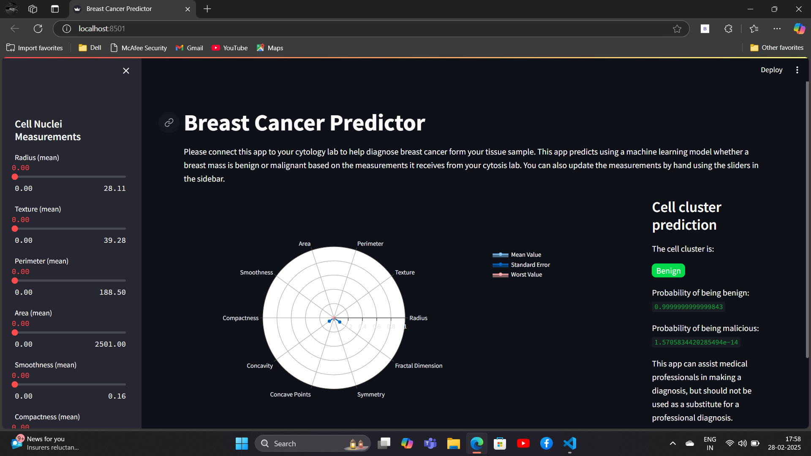
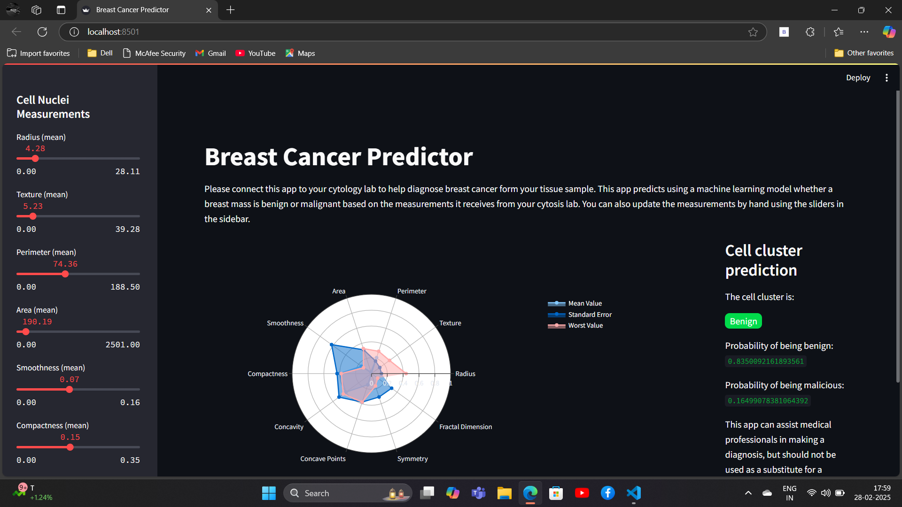
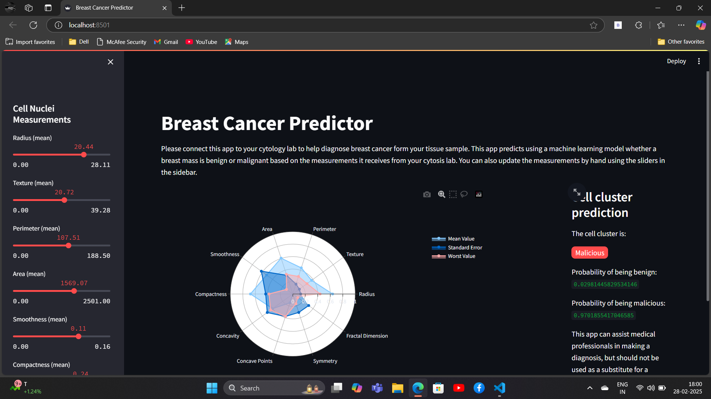

# Breast Cancer Prediction using Streamlit

## Overview
This project is a web-based application developed using **Streamlit** that predicts whether a tumor is benign or malicious based on input features. The prediction is powered by a machine learning model trained on a breast cancer dataset.

## Features
- User-friendly web interface built with **Streamlit**
- Accepts user input for relevant cancer diagnosis features
- Uses a pre-trained machine learning model for prediction
- Displays the prediction results in real-time

## Technologies Used
- **Python**
- **Streamlit** (for building the web interface)
- **Scikit-learn** (for machine learning model training)
- **Pandas & NumPy** (for data handling)
- **Pickle** (for Serialization)
- **Plotly** (for Visualization)

## Usage
1. Open the application in your browser.
2. Enter the required input features for prediction.
3. The app will display whether the tumor is **benign** or **malicious**.

## Dataset
This application is based on the **Breast Cancer Wisconsin (Diagnostic) Dataset**, available from the UCI Machine Learning Repository.

## Screenshots

### Breast Cancer Predictor Dashboard

### Prediction - Benign Tumor

### Prediction - Malicious Tumor

## Contributing
If you’d like to contribute, feel free to submit a pull request or open an issue.

## Contact
For any inquiries, feel free to connect with me on [LinkedIn](https://www.linkedin.com/in/bharathkp1/).

